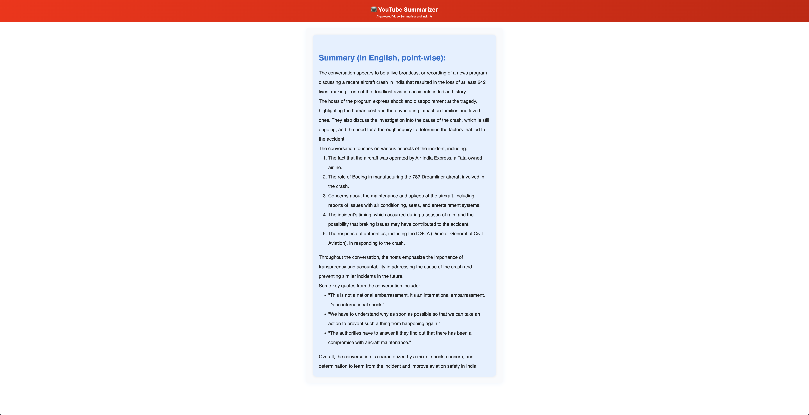

# LeetCodeLLMMentor

A Chrome extension that analyzes LeetCode problems and your code attempts, providing background knowledge and code analysis using a local LLM (Ollama) via a Python proxy. All processing is local and private.

---

## Features
- Extracts problem statement and code from LeetCode pages
- Sends them to a local LLM (Ollama) for analysis and hints
- Beautiful, responsive UI with markdown rendering
- No cloud API keys required (uses your local Ollama model)
- Works with any Ollama-supported model (e.g., llama3.2, mistral)

---

## Setup Instructions

### 1. **Install Ollama and a Model**
- [Download Ollama](https://ollama.com/download) and install it for your OS.
- Pull and run a model (e.g., llama3.2):
  ```bash
  ollama run llama3.2
  ```
  (Or use `ollama run mistral` for a smaller, faster model.)

### 2. **Set Up the Python Proxy**
- Install dependencies:
  ```bash
  pip install flask flask-cors requests
  ```
- Start the proxy:
  ```bash
  python ollama_proxy.py
  ```
  This will listen on `http://localhost:3002/ollama` and forward requests to Ollama.

### 3. **Install the Chrome Extension**
- Clone or copy this repo.
- Download `marked.min.js` from [here](https://cdn.jsdelivr.net/npm/marked/marked.min.js) and place it in the extension directory.
- Go to `chrome://extensions/` in Chrome.
- Enable Developer Mode.
- Click "Load unpacked" and select this folder.

---

## Usage
1. **Open a LeetCode problem page.**
2. Click the LeetCodeLLMMentor extension icon.
3. Click **Analyse Your Solution**.
4. The extension will extract the problem and code, save a JSON, and open a full-page UI.
5. The full-page UI will call your local LLM (via the Python proxy) and display a markdown-formatted analysis and hints.
6. The UI is fully responsive and works on any screen size.

---

## Customization
- **Model:** Change the model in `fullpage.js` (e.g., `'llama3.2'`, `'mistral'`).
- **Prompt:** Edit the prompt in `getOllamaResponse` in `fullpage.js` to change the LLM's behavior.
- **Token Limit:** Adjust `num_predict` for longer or shorter responses.

---

## Troubleshooting
- **Ollama must be running** with your chosen model before using the extension.
- **Python proxy must be running** (`python ollama_proxy.py`).
- If you see CORS or 403 errors, make sure you are calling the proxy, not Ollama directly.
- For markdown rendering, ensure `marked.min.js` is present in the extension directory.
- For long responses, scroll in the output area.

---

## Security & Privacy
- All processing is local. No data is sent to the cloud.
- No API keys are required for cloud LLMs.

---

## Credits
- [Ollama](https://ollama.com/) for local LLM serving
- [Marked.js](https://marked.js.org/) for markdown rendering
- [Flask](https://flask.palletsprojects.com/) for the Python proxy

---

## License
MIT 